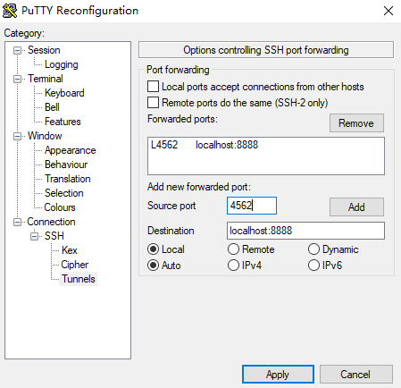
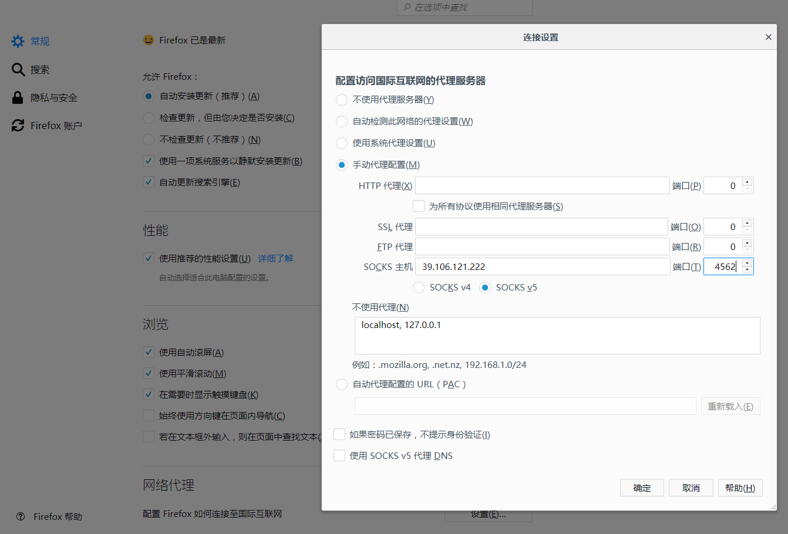

## 前言

这篇文章主要是记录如何搭建一个能够运行深度学习库mxnet的python环境，需要说明的是，我是在阿里云云服务器的远程主机上安装的，系统为Ubuntu1604，不过后面我也在我自己的Win10的本地主机上安装了一次，由于conda本身是夸平台的所以安装的流程都差不多。

## 搭建环境

### 1. 安装minicoda

为了保持python环境的纯净性，我们将为mxnet专门创建一个新的python环境，使用conda来管理系统中多环境，所以安装miniconda和anaconda都是可以的。鉴于我的python环境是会重新安装的，所以我这里安装更加小巧的miniconda。

终端中执行如下命令下载miniconda，当然如果有图形界面用浏览器下载也是一样的（唯一需要注意的是选择你系统对应的版本和机器的位宽，我是Ubuntu系统 64bit的机器，自然是选择Linux 64bit版本）：

```{.python .input}
wget -c http://repo.continuum.io/miniconda/Miniconda-latest-Linux-x86_64.sh
```

上面是miniconda官方的下载地址，国内速度比蜗牛还慢，简直不能忍，于是切换为国内清华提供的下载源：

```{.python .input}
wget -c https://mirrors.tuna.tsinghua.edu.cn/anaconda/miniconda/Miniconda3-latest-Linux-x86_64.sh
```

下载完整后安装操作就简单了：

```{.python .input}
chmod +x Miniconda-latest-Linux-x86_64.sh
./Miniconda-latest-Linux-x86_64.sh
```

### 2. 安装mxnet的python环境

nxnet作为一个深度学习框架，是需要不少其他python库支持的，当前最重要的就是Numpy了。而conda是提供复制别人的环境的，所以从下载官方向导文件中提供的环境配置文件：

```{.python .input}
git clone https://github.com/mli/gluon-tuto rials-zh
```

当然这命令的前提是，装好了git，git安装简单就不讲了。在下载的文件夹中的environment.yml就是我们所需要的文件，使用conda复制创建一个mxnet的python环境：

```{.python .input}
conda env create -f environment.yml
```

等待一些列库的安装完成就可以了，在environment.yml文件中，将环境名命名为gluon，所以后面需要使用gluon进入该环境，关于用conda来切换管理多python环境我之间有总结过，这里就不讲了。

### 3. 为jupyter notebook配置其远程服务

jupyter notebook是官方推荐的开发环境，在复制创建的gluon中已经安装好了，由于我是在远程主机上安装的环境，所以我现在需要为jupyter notebook配置远程服务，操作如下：

首先，生成jupyter notebook的配置文件jupyter_notebook_config.py：

```{.python .input}
jupyter notebook --generate-config
```

然后打开jupyter_notebook_config.py：

```{.python .input}
vim ~/.jupyter/jupyter_notebook_config.py
```

修改配置如下：

```{.python .input}
c.NotebookApp.ip='*'
c.NotebookApp.open_browser = False
c.NotebookApp.port =8888 #随便指定一个没有被占用的端口
```

修改完成后保存，打开jupyter notebook，root用户打开需要加以下选项：

```{.python .input}
jupyter notebook --allow-root
```

至此jupyter notebook远程服务器部分操作完成，我们可以从本地机的浏览器中输入登陆远程服务器的jupyter的地址就可以登陆：IP:PORT。

不过很多时候由于防火墙的阻挡这样是不能正常连接jupyter的，对此最好的解决方法是在本地机上建立ssh通道访问jupyter，如果本地机是Linux系统那么只需要一条命令即可：

```{.python .input}
ssh -L8888:lcalhost:4562 远程主机登陆用户@远程主机IP
```

这样就可以将远程的8888jupyter端口映射到本地的4562端口上来，在浏览器中输入：localhost:4562，即可连接到远程的jupyter notebook。

对于本地机是Windows的用户，可能就要使用工具来建立ssh端口映射了，我是用的putty，设置Connection->SSH->Tunnels，添加从本地端口到远端端口的通道，然后通过SSH登录到服务器，截图如下：



最后在浏览器中设置代理，建议最好用火狐，可以设置仅限于火狐自身的局部代理，而不会影响全局的上网功能，截图如下（**不过我后面发现，其实是不需要设置浏览器代理的**）：




### 4. 配置jupyter notebook的markdown文件读写功能

使用过jupyter notebook的人都知道，jupyter notebook的默认工作文件格式为.ipynb，我们希望将其切换为markdown格式（因为mxnet的gluon向导全部使用md文件），所以需要安装notedown插件：

```{.python .input}
pip install notedown
```

说实话，notedown这个插件，不是很好装，我在gluon环境中没有安装上，退出了gluon环境后用pip装好的，很奇怪。安装好以后，再次修改配置文件jupyter_notebook_config.py如下：

```{.python .input}
c.NotebookApp.contents_manager_class = 'notedown.NotedownContentsManager'
```

### 5. 导入mxnet出错

我进入gluon环境，在python代码中导入mxnet，如果出现以下错入：

```{.python .input}
libgfortran.so.3: cannot open shared object file: No such file or directory
```

说明系统中缺少libgfortran库，直接使用apt-get安装即可：

32 bit系统

```{.python .input}
sudo apt-get install libgfortran
```

64 bit系统

```{.python .input}
sudo apt-get install gfortran-multilib
```

## 测试端口是否打开

可能在连接远程jupyter notebook服务时会遇到其他一些问题，检查网络端口的情况会给调试很大的帮助，所以这里再补充说明下测试网络端口的问题，在Linux下测试网络端口的方法很多，我这里使用netcat（简称 nc）工具来检查。首先安装（以Ubuntu为例）：

`sudo apt-get install netcat`

测试主机端口是否打开命令如下：

`nc -zv [IP] [port] `

上面的命令中，这些标志是：

+ z  设置 nc 只是扫描侦听守护进程，实际上不向它们发送任何数据。
+ v  启用详细模式
