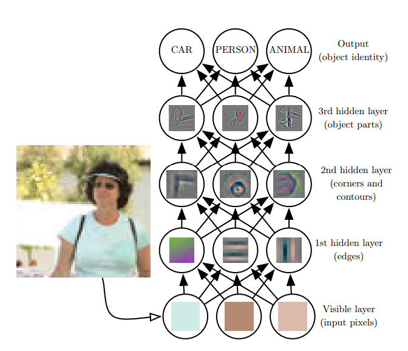
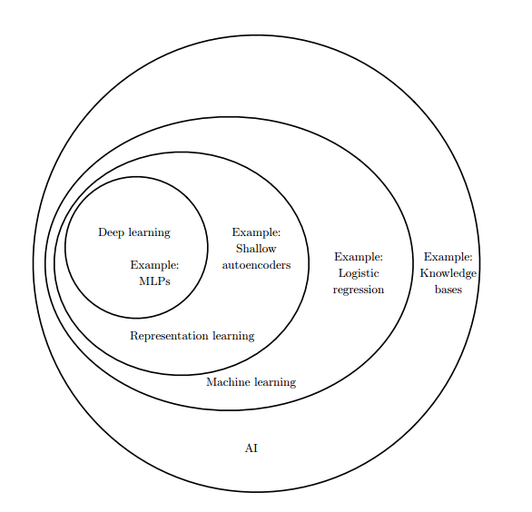

## 前言

“学而不思则罔，思而不学则殆”，最近一直是一股老儿的接触新知识，我觉得有必要做一下梳理了，再不消化一下，也许就得撑死了。于是借助《Deep Learning》一书的引言部分，对最近看到的人工智能相关概念做一个小结。

## 从人工智能到深度学习

赶上这两年的AI热，我最近也一直在看这方面的书籍和资料，面对当前五花八门的新概念新名词，是既然让人既兴奋又困惑，兴奋的是自己能够了解到当前计算机人工智能领域最新的进展和进步，困惑的是这些看似相关性不大的概念名字是怎么和人工智能联系在一起的呢？要了解这些，有必要粗略回顾一下人工智能的发展历史。

实际上，创造能自主思考的机器是人类很早的梦想了，不够那时候还是只是一个美好的幻想，但是计算机的出现让这样的幻想有了实现的可能。

作为软件人员，我们知道，一直以来计算机软件的设计思路都是，开发人员需要深入理解要解决的问题，将该问题设计出一套规则和逻辑来解决，而早期的人工智能也正是沿着这种思想。这种基于**知识和规则**达到智能的方法，希望将世界的知识用形式化的语言进行硬编码，让计算机可以使用逻辑推理规则来自动地理解这些形式化语言中的声明，从而做出推断和决定。在《Deep Learning》一书中有提到基于人工智能的**知识库（knowledge base）**的Cyc项目尝试理解现实世界，但是将“Fred正拿着一个电动剃须刀”这样很简单情形推断出“Fred在刮胡子的时候是否仍然是一个人”结论。实际上对人来说，要设计出一套复杂的形式化规则能够像数学公式一样精确地描述世界来说太难了。

而其后，研究者们开始转向，他们希望AI系统能够自己从原始数据中提取模式、发现规则。从我个人的观点来看，这种思维方式转变是非常关键的，它让我们从一个传统的软件开发人员转向一个数据挖掘者。而这就是**机器学习**，机器学习在特定的问题领域很有用，因此在当前的被广泛的使用。然而，简单的机器学习仍然脱离不了人对原始数据的规整，机器学习所需要的数据输入时，需要人选取一系列能描叙实际情况的特征的集合来表示现实世界的情况，对原始数据表示的方法不同直接决定了后面机器学习的好坏。而面对现实世界的各种情况，机器学习是无法直接处理的。

然而，很多时候我们并不知道要选用哪些特征来表示原始数据会更好，为了解决这个问题，研究者们再了进一步，他们希望机器能自己挖掘表示本身，自己选择事物的描叙特征，这被称为**表示学习**。世界上表示学习也是通过机器学习的方法来学习表示，不过学习到的表示往往比手动设计的表示表现得更好，并且它们只需最少的人工干预，就能让AI系统迅速适应新的任务。

在一些环境复杂的系统中，要提取特征，需要高层次的抽象，在这种情况下简单的表示学习就没法做到的。在这里**深度学习**，多层抽象，先学习较简单的表示，然后用简单的表示来构建更复杂的表示。下图为《Deep Learning》中一个深层网络的示意图：

从以上可以看到，深度学习相比浅层的表示学习的“深”至少有两层含义：一是实际计算图层次变深，二是在学习的过程中，不同的层学习的对象有了明显功能的差异，高层的的网络能够对低层次的网络学到的结果基础上再进行学习。

至此，关于机器学习、表示学习、深度学习之间的关系，我们大致已经清楚，借助《Deep Learning》书中的维恩图能够更清晰的展示：

从上面的人工智能技术的发展，能够看到，深度学习是当前人工智能领域最前沿的技术。对于深度学习，在《Deep Learning》书中总结的很好：

> 深度学习是通向人工智能的途径之一。具体来说，它是机器学习的一种，一种能够使计算机系统从经验和数据中得到提高的技术。我们坚信机器学习可以构建出在复杂实际环境下运行的 AI 系统，并且是唯一切实可行的方法。深度学习是一种特定类型的机器学习，具有强大的能力和灵活性，它将大千世界表示为嵌套的层次概念体系。

## 学习心得

实际上，我接触机器学习已经有很长的时间了，但是只到最近才感觉自己刚刚入门，这些天里能够对这些概念有进一步的理解的原因，我想主要是一下两方面：

+ 第一是，对线性代数、概率论与数理统计等基本数学学科的补习
+ 第二是，真正自己动手对简单机器学习算法的编码实现和验证

这让我再次深刻理解到了，数学是各们学科、技术的基础，也知道了那些看似很高端很先进的技术其实不一定用了很深入的数学理论。对我这种数学基础稍差的人来说，针对性的补习一下数学的基础对机器学习/深度学习理解是有非常大的帮助，同时也要相信那些高大上的名词其背后的数学原因实际上是相对简单，所以不要一开始就被吓唬住了。

虽然，数学基础的补习让那些曾经困扰我许久的问题得到解决，但是直到我真正动手一步一步的实现一个最简单的算法的时候，我才感觉真正步入了机器学习/深度学习的大门。从最简单的线性回归，到softmax的多分类器，再到浅层前馈神经网络——多层感知机，基本上也是沿着前人曾经探索的道路前进，虽然大多都只是百来行python代码（使用框架模型后更少），但是却让我能够深入真正体会它的方法原理和实际性能以及不足和缺陷。

## 后面的学习方向

由于我主要的兴趣点在图像上，所以未来的学习方向应该会集中在各种卷积神经网路上。对我来说道路还很漫长，前面实现过的算法，基本上还是传统的机器学习的范畴，从卷积神经网路开始才慢慢踏入深度学习的领域。另外，算法的ren
